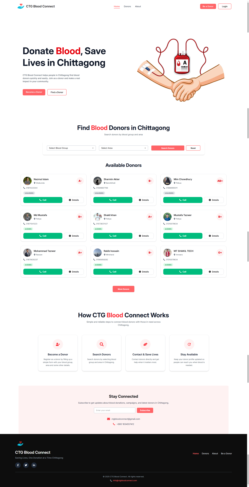
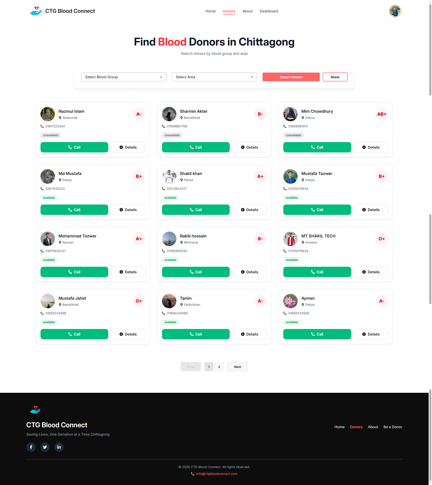
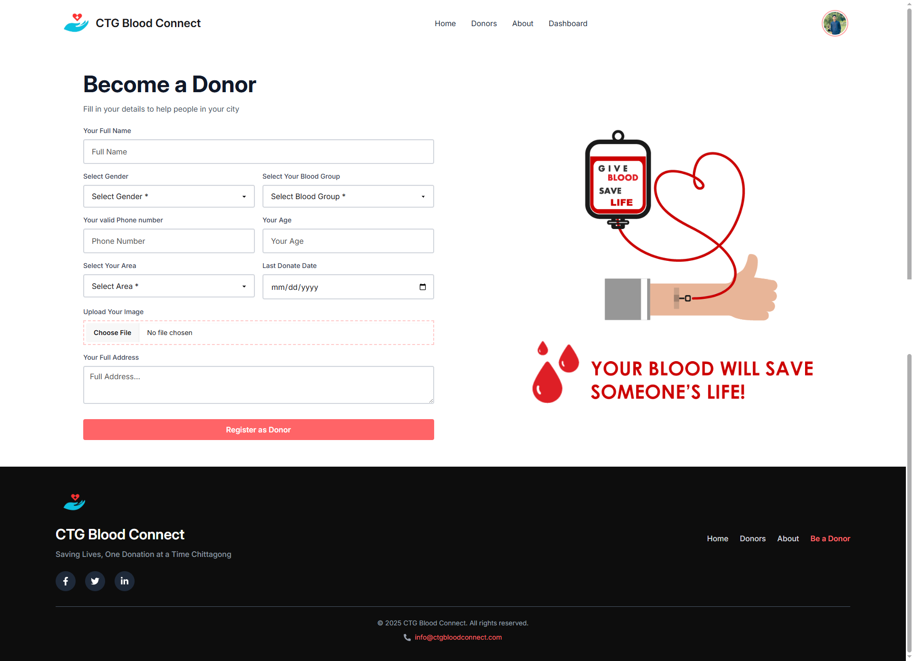
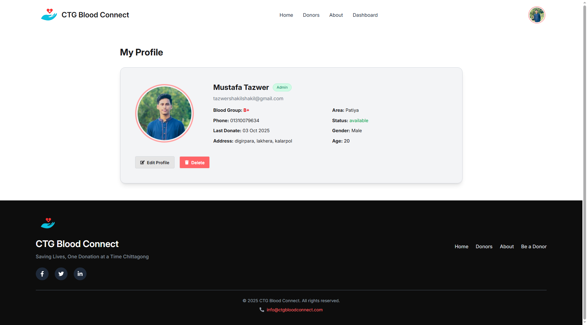
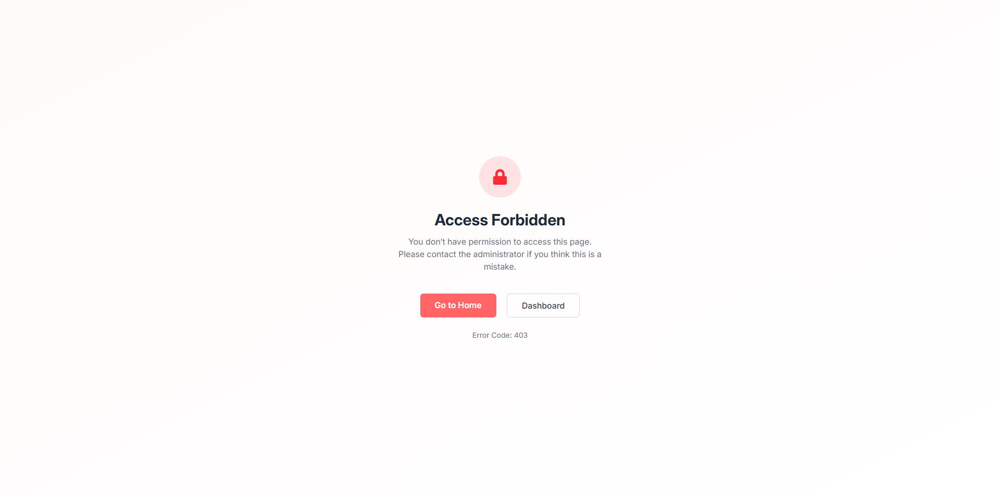
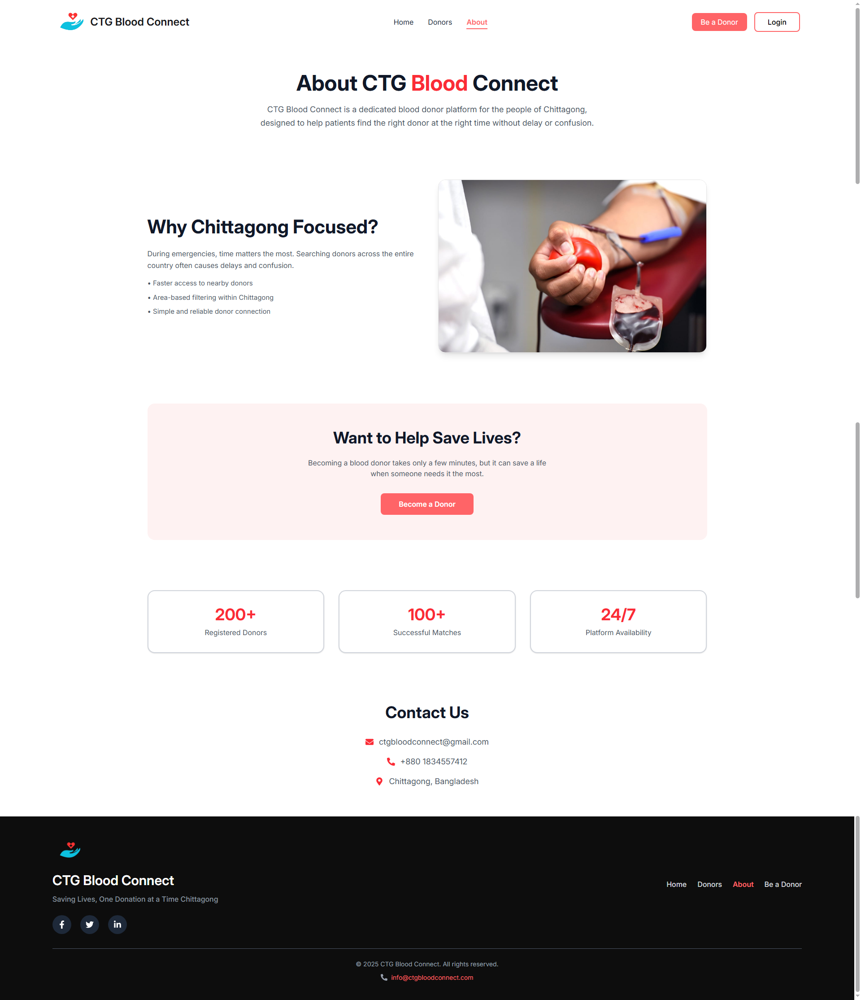
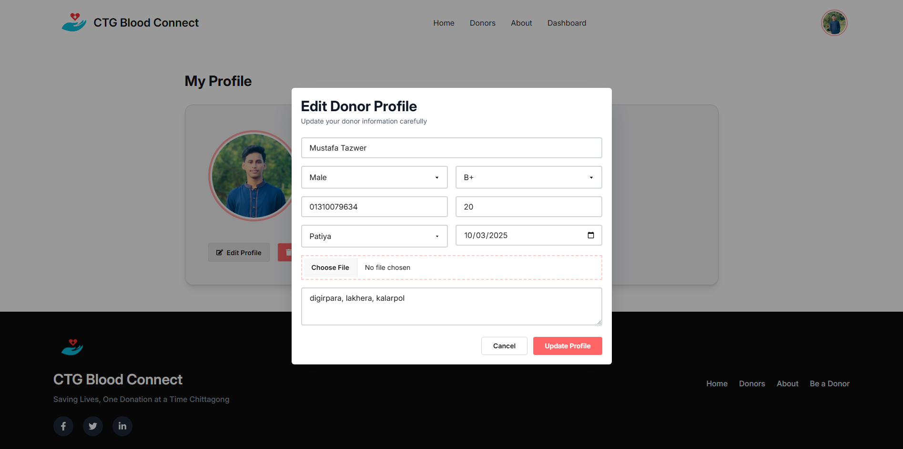
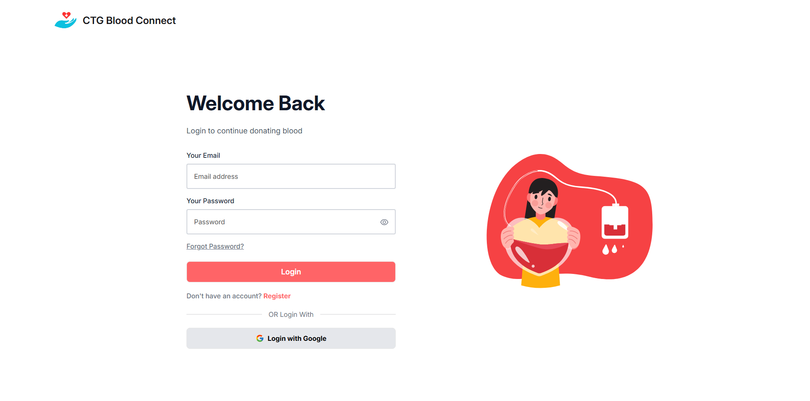
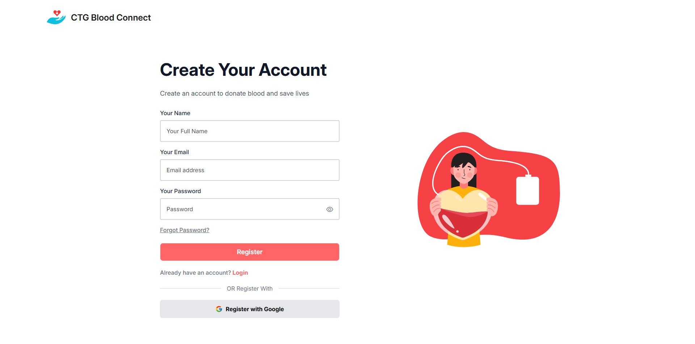
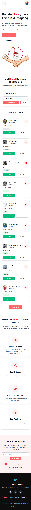

## 🩸 CTG Blood Connect

CTG Blood Connect is a web-based blood donor platform designed to help people in **Chittagong (CTG)** quickly find blood donors based on blood group and area.  
The mission is simple: **connect donors and seekers to save lives**.

## 🌐 Live Project
🔗 https://ctg-blood-connect.web.app/

## 📦 Repositories
- Client: https://github.com/sahkil12/CTG-Blood-Connect-client
- Server: https://github.com/sahkil12/CTG-Blood-Connect-server


## 🚀 Features

### 👥 User & Donor System
- Email & Google authentication using Firebase
- Default role: `user`
- Users can register as blood donors
- Automatic role update from `user` to `user + isDonor`

🔹 **NEW**
- Automated email system using **Nodemailer**
- Welcome email sent when a user registers
- Congratulations email sent when a user becomes a donor

### 🩸 Donor Management
- Create donor profile with some details and image
- Update donor information
- Delete donor profile (role reverts to user)
- Donor availability status tracking

### 🔍 Donor Search
- Search donors by blood group
- Filter donors by area (CTG upazilas)
- Homepage displays top 9 donors
- Full donors list page with advanced filtering

### 🧑‍💼 Admin Dashboard
- Role-based protected admin routes
- Dashboard statistics:
  - Total users
  - Total donors
  - Available donors
  - View donor availability in real-time  
  - Total admins
  - New users & donors (last 7 days)
- Manage users:
  - Search any users by email
  - Make or remove admin role
  - View user details in modal

### 🔐 Security & Access Control
- JWT-based authentication
- Role-based authorization (User / isDonor / Admin)
- Admin-only dashboard access
- Forbidden (403) page for unauthorized routes

## 🧩 Pages
- Home
- Donors
- Be a Donor
- Profile
- About
- Admin Dashboard
- Manage Users
- Forbidden Page (403)
- Error 404 page
---

## 🖼️ Screenshots

### 🏠 Home Page


### 🩸 Donors Listing Page


### 🧾 Become a Donor Page


### 👤 User Profile Page


### 📊 Admin Dashboard


### 🚫 Forbidden (403) Page


### ℹ️ About Page


### ✏️ Edit Profile Modal


### 🔐 Login Page


### 📝 Register Page


### 📱 Mobile View 


## 🛠️ Tech Stack

### Frontend
- React
- React Router DOM
- Tailwind CSS
- DaisyUI
- Axios
- TanStack Query
- Firebase Authentication && deploy
- React Hook Form
- Recharts
- SweetAlert2
- React Hot Toast
- dayjs
- lottie-react
- react-helmet

### Backend
- Node.js
- Cors
- Express.js
- MongoDB
- JWT Authentication
- REST API
- Role-based access control
- nodemailer
- Firebase admin

### Hosting & Tools
- Client Hosting: Firebase
- Server Hosting: Vercel
- Database: MongoDB Atlas

## 🎯 Project Goal

**This platform is designed to:**

- Make blood donation faster & easier in Chittagong City
- Reduce emergency delays
- Encourage people to become donors
- Help the Chittagong community


### Installation

## Clone the repositories

 **Client**

```bash
git clone https://github.com/sahkil12/CTG-Blood-Connect-client.git
```
```bash
cd CTG-Blood-Connect-client
```
```bash
npm install
```

 **Server**
```bash
git clone https://github.com/sahkil12/CTG-Blood-Connect-server.git
```

```bash
cd CTG-Blood-Connect-server
```

```bash
npm install

```

## Run project

**Client**
```bash
cd CTG-Blood-Connect-client
```
```bash
npm run dev
```
**Server**
```bash
cd CTG-Blood-Connect-server
```
```bash
npm run start
```
---

## 👨‍💻 Developer

**Mustafa Tazwer Shakil**  
Web Developer  
📧 Email: tazwershakilshakil@gmail.com  
🌐 Portfolio: https://mustafa-tazwer.vercel.app/

## 📄 License

This project is licensed under the MIT License.

### ❤️ Made with Love

Crafted with care by **Mustafa Tazwer Shakil** to support blood donation in Chittagong.
